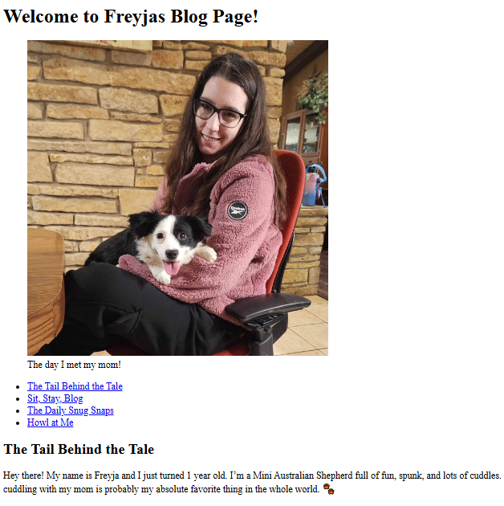
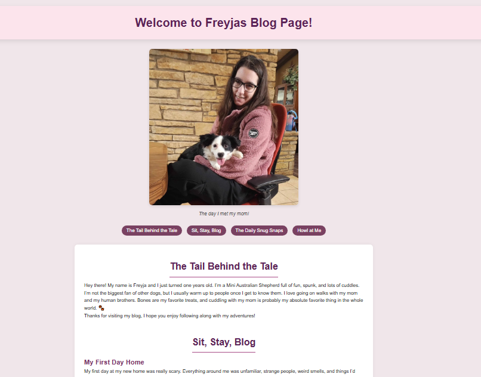
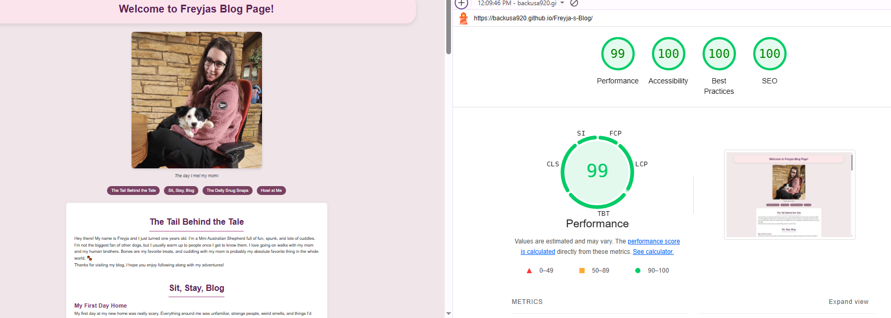

<h1>Welcome to Freyja's Blog Page</h1>

Welcome to Freyja’s Blog, a lovingly crafted, single-page HTML site that shares the adventures of Freyja, a spunky, cuddly, one-year-old Mini Australian Shepherd. This blog captures her journey from her very first day home to her first birthday, complete with adorable stories, cute photo galleries, and lots of tail-wagging moments.

Created as a personal and creative project, this site combines beginner-friendly HTML structure with semantic tags, accessibility-friendly elements, and a fun, pun-filled personality. It's a celebration of love between a dog and her human, built with code and heart. 🐶💻

  
  
This is the foundational HTML layout structure for my blog page, created prior to applying my css styling.

  
  
This is my updated screenshot after CSS styling has been added and updated.

  
  
This update demonstrates how well my blog page aligns with accessibility standards. It is a goal to not only make visually appealing webpages but to have them meet all compliance and performance goals as well.

  

  
